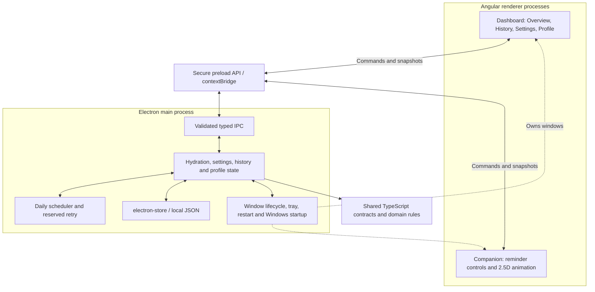
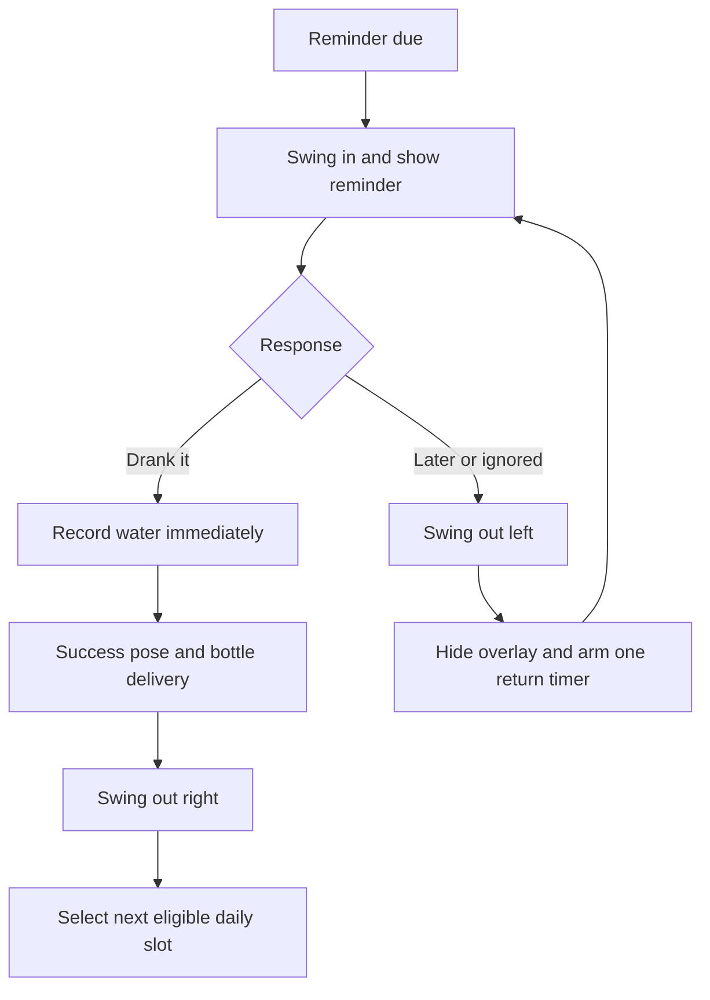

# SlingSip
<!-- https://www.tajmirul.site/   -->
**Desktop Hydration Companion**

*Swing in. Sip up. Keep going.*

SlingSip is a local-first desktop application built with Angular and Electron. It runs quietly from the system tray, schedules hydration reminders around your routine, and brings a web-swinging companion onto the screen when it is time to drink. Brief, interactive water breaks help you keep track of hydration during long desktop sessions.

## Demo

**Demo Video Coming Soon**

**Portfolio Showcase Coming Soon**

The [demo freeze guide](docs/slingsip-demo-freeze.md) includes production setup and a 60-second recording sequence.

## Product features

- **Animated desktop companion:** PNG-based 2.5D body animation, curved web swings, gentle settling and bottle delivery.
- **Transparent overlay:** reminder controls remain clickable while transparent regions pass clicks to applications underneath.
- **Hydration routine:** configurable daily goal, glass size, active hours and reminder preferences; progress and next-break information update across windows.
- **Drink or defer:** **Drank it** records water immediately and plays a bottle success sequence; **Remind me later** and ignored reminders exit left and reserve a return.
- **History and streaks:** daily records, current/best streaks and local-calendar rollover that archives the previous day before resetting today's progress.
- **Onboarding and profile:** first-run welcome, local display name, routine setup, dashboard tour and profile editing.
- **Background lifecycle:** tray actions, pause/resume, dashboard close/reopen, state-preserving **Restart SlingSip** and a Windows startup preference.
- **Windows update infrastructure:** stable GitHub release checks, verified downloads and explicit **Restart & Update** for signed installed builds.
- **Desktop dashboard:** responsive Overview, History and Settings pages, plus reduced-motion, low-power, sound and cursor-awareness preferences.

## Tech stack

Versions below are pinned in `package.json` and `package-lock.json`.

| Layer | Implementation |
| --- | --- |
| Frontend | Angular **22.2.1**, TypeScript **6.0.3**, standalone components, Signals/computed state, SCSS/CSS |
| Desktop | Electron **44.5.1**, `BrowserWindow`, sandboxed preload, `contextBridge`, typed IPC and electron-updater **6.8.9** |
| Persistence | `electron-store` **11.0.2**, main-owned local JSON records |
| Animation | Approved PNG poses and swing frames, SVG webs, code-controlled trajectories, finite RAF and browser idle animation |
| Build | Angular CLI/build **22.2.1**, esbuild **0.28.2** for Electron main/preload, electron-builder **26.15.3** for Windows NSIS |
| Testing | Playwright **1.63.0**, Electron integration tests, domain/clock fixtures and a Windows native pointer helper |

Angular provides structured routing and reactive UI state for the dashboard, settings and onboarding. Electron provides native windows, tray/background execution and OS integration while keeping filesystem access and reminder scheduling outside the renderer.

## Engineering highlights

- **Secure process boundary:** `contextIsolation` and sandboxing are enabled; Node integration is disabled. The preload exposes a typed API rather than raw `ipcRenderer`. Main checks requesting windows/frames and command payloads; navigation, new windows and permissions are restricted.
- **One background owner:** main retains the scheduler when the dashboard closes. A single-instance lock avoids duplicate owners. Restart persists state, cancels timers, destroys windows/tray, then uses `app.relaunch()` and `app.exit()`.
- **Consistent state across windows:** revisioned snapshots synchronize dashboard and companion views with tray state. Reminder revisions prevent the same prompt from crediting a drink twice.
- **Clock and retry management:** a main-owned scheduler selects future slots within active hours, reconciles rollover/resume, and avoids backfilling missed reminders. One reserved return timer prevents overlapping daily and deferred prompts.
- **Stable historical records:** each finalized day retains its original goal. Profile/onboarding and companion preferences have separate records, so replaying setup does not erase hydration history.
- **Animation lifecycle:** a finite state machine coordinates body frames, screen trajectories, webs, bottle delivery and directional exits. RAF runs outside Angular and is cleaned up when hidden; idle uses browser animation. Reduced motion and low-power settings alter visual work without changing intake rules.

## Architecture



**Electron main owns business state, timers, persistence and OS integration.** Angular services derive UI state from snapshots and send commands through the preload bridge. The companion renderer controls visual choreography; it does not own the hydration clock.

## Reminder flow



Retry uses the saved interval, five minutes by default in production. Pause, reminders OFF, midnight and a drink that satisfies a pending prompt cancel deferred work. Restart clears session-only retries and reconstructs the future schedule from saved data.

## Local-first and privacy

No cloud account, login or application backend is required. Hydration/settings/history, the local profile and companion preferences are saved by Electron main in `hydration.json`, `user-profile.json` and `companion-preferences.json`. The application does not encrypt these local JSON files or provide cloud sync.

Configured signed Windows installations check the public GitHub release feed for updates. Downloads and installation require explicit actions; update networking is handled in Electron main.

For compatibility with existing data, the normal Windows profile remains under `%APPDATA%\Mizu` and Windows startup retains the `Mizu` registration name. These legacy identifiers are intentional; current application branding is SlingSip. See the [branding/storage compatibility report](docs/slingsip-branding.md).

## Onboarding

First-run setup moves through **Welcome → Your name → Your routine → Meet SlingSip**, then offers a guided dashboard tour. Routine choices use the existing settings service. **Start my day** persists completion; **Set up later** leaves it incomplete and setup returns on the next dashboard open or app restart. Display name and member-since survive restart.

From the profile chip, **Replay welcome tour** runs only the dashboard tour. **Reset onboarding** clears its completion flag, allowing setup to reopen, while retaining name, creation date, water, history and settings. Profile editing updates the greeting, chip and initials. Details: [onboarding and local profile](docs/slingsip-onboarding.md).

## Run locally

The validated platform is Windows. Use Node **24.x, at least 24.15.0**, and npm; QA used Node **24.21.0**. Other supported Node ranges are listed in `package.json`.

```powershell
npm ci
npm run dev
```

Development uses Angular HMR/live reload. Main/preload/shared TypeScript changes rebuild and restart the managed Electron process after the old one exits. Asset changes refresh the renderers with cache bypass. See the [restart/development workflow](docs/slingsip-restart-workflow.md).

| Purpose | Command |
| --- | --- |
| Production build | `npm run build` |
| Build and launch production locally | `npm start` |
| Type checking | `npm run typecheck` |
| Build and run the complete test suite | `npm test` |
| Run Electron tests against an existing build | `npm run test:electron` |

Quit the current instance through **tray → Quit SlingSip** before switching development/production modes; closing dashboard X keeps the background owner alive. Production hides development controls and rejects development-trigger IPC.

Tests use isolated profiles. No Playwright browser download is needed. The native pointer test moves/clicks the physical mouse and requires an unlocked desktop with the mouse idle.

## Quality assurance

Recorded hydration demo Final QA: **8 October 2026**, before the release-infrastructure addition.

**READY FOR DEMO WITH ONE KNOWN TEST-HARNESS LIMITATION**

Type checking and production Angular/Electron builds passed. Regression coverage includes security/production gates, hydration and retry flows, daily rollover, history/streaks, persistence/restart, onboarding replay/reset, tray and Windows startup. Latest per-test automated outcomes after the full run and targeted reruns: **110 passed, 1 failed, 0 skipped**. Demo freeze checks also verified production UI, branding and asset loading.

The automated native pointer regression remains flaky because of Windows cursor/target-ownership interference. **User-reported manual physical QA passed** transparent click-through, Chrome/VS Code interaction behind the overlay, Drank it/Later controls, tray reopen and restart preservation without duplicates. There is **no confirmed production click-through defect**; the automated failure remains recorded.

See the [Final QA report](docs/slingsip-final-qa-2026-10-08.md), [validation record](docs/slingsip-final-qa-2026-10-08-validation.json) and [demo freeze validation](docs/slingsip-demo-freeze-validation.json). The overlay uses the primary display's work area; physical multi-monitor/DPI certification is outside the recorded demo checks.

## Application updates and Windows packaging

Settings → **About & Updates** shows the actual version, check status and update actions. Meaningful availability/progress/ready state appears in the header; downloaded updates also appear in the tray. **Restart & Update** saves local state before the updater's install/relaunch handoff. Normal **Restart SlingSip** remains independent.

The provider is public GitHub Releases for **ak-ak-k/slingsip**, with stable-only selection and no embedded token. Source/development runs and unsigned previews cannot install updates. Windows distribution uses a signed NSIS installation; the signing identity and real installed update acceptance test remain prerequisites before distribution.

- `npm run package:dir`: build an unsigned, update-disabled local preview.
- `npm run package:win`: build signed NSIS artifacts after configuring signing. It does not publish.

See the [update infrastructure report and release checklist](docs/slingsip-updates.md) and its [separate validation record](docs/slingsip-updates-validation.json). No installer or release has been published.

The [V1 release readiness dry run](docs/slingsip-v1-release-dry-run.md) verifies local packaging and the packaged application. Version stamping, signing and signed installed-app acceptance remain pending.

Maintainers: see [Windows code-signing onboarding](docs/windows-code-signing.md) for PFX/store setup, exact publisher verification and the future signed V1 release commands. The version remains **0.1.0** until the real release is authorized and certificate details are ready. Public author metadata is still a documented placeholder; fill `package.json.author.name` with the intended public identity before release.

## Project structure

```text
src/       Angular routes, dashboard, onboarding, companion UI and animation
electron/  Main process, preload/IPC, windows, tray, scheduler and storage
shared/    Typed contracts, validation, hydration/history and scheduling rules
public/    Current companion/onboarding artwork, logos and runtime assets
scripts/   Development supervision, build pipeline and asset preparation
tests/     Domain and native Electron regression tests
docs/      QA evidence, compatibility reports and demo preparation
```

## Screenshots

| View | Placeholder |
| --- | --- |
| Overview | Overview screenshot to add |
| Companion Reminder | Desktop reminder screenshot to add |
| History | History screenshot to add |
| Settings | Settings screenshot to add |
| Onboarding | Welcome/profile/tour screenshot to add |

Existing test captures are indexed in the [native Final QA gallery](docs/previews/final-qa-2026-10-08/index.html); recruiter-facing captures can be added above after recording.

## Roadmap — FUTURE

- Optional email/calendar smart alerts.
- Expanded desktop sidekick capabilities.
- Packaged Windows release.
- Portfolio web showcase.

## Author

- **Name:** To add.
- **GitHub:** Profile link to add.
- **Portfolio:** Showcase link to add.
