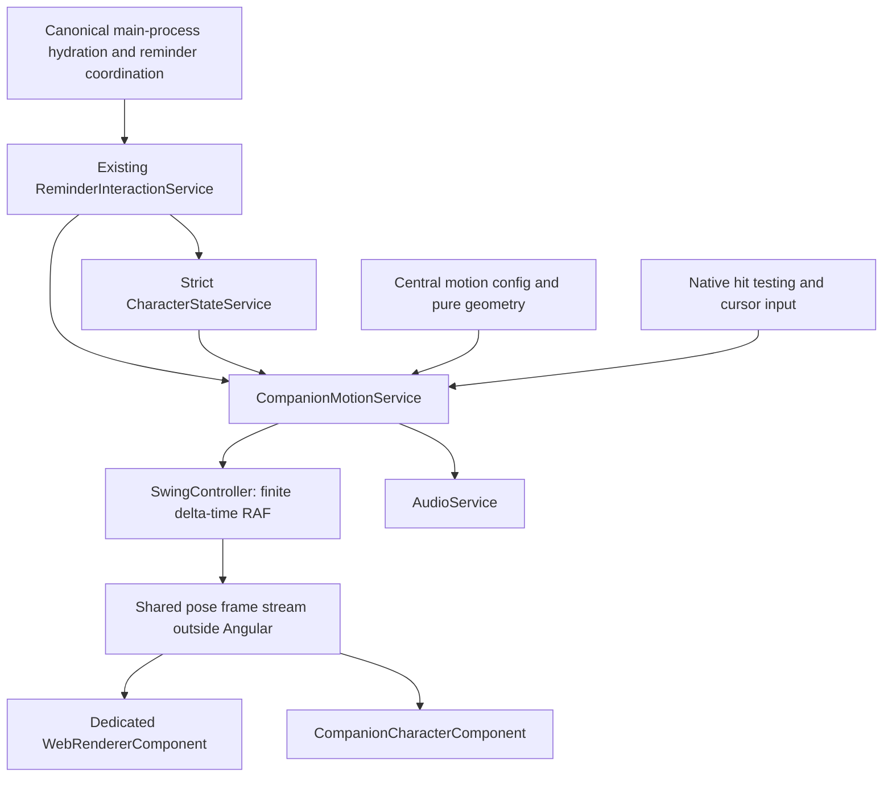

# Phase 7D — Advanced professional companion engine

Historical pre-3D implementation, built locally on 6 October 2026. Current rendering, validation and final asset requirements are in [Phase 7E](phase-7e.md). The original character paths, SlingSip branding and dashboard layout remain. Hydration calculations, intake, history, streaks, scheduling, retries, tray and startup continue to use the existing main-process implementation. This phase stops at local motion review.

## 1. Files created

| File | Purpose |
| --- | --- |
| `src/app/features/companion/animation/companion-motion.service.ts` | Reusable motion coordinator, frame subscriptions, preferences, cursor and click reactions. |
| `src/app/features/companion/animation/swing-controller.ts` | Finite, cancellable delta-time frame owner with pause/resume and render-rate cap. |
| `src/app/features/companion/animation/entry-variants.ts` | Weighted selection and four pure entry paths. |
| `src/app/features/companion/web-renderer.component.ts` | Dedicated thin SVG web renderer sharing character/bottle poses. |
| `src/app/features/companion/animation/audio.service.ts` | Original Web Audio cues with mute, volume, activity gating and cleanup. |
| `src/app/features/companion/animation-lab.component.ts` | Isolated development preview without hydration/scheduler commands. |
| `src/app/features/settings/companion-preferences.component.ts` | Separate explicit-save sound/motion controls. |
| `shared/companion-preferences.ts` | Strict validation and safe defaults for independent preferences. |
| `electron/companion-preferences-storage.ts` | Main-owned independent preference file. |
| `tests/advanced-companion.spec.mjs` | Selection, path, lifecycle, preference, native interaction and lab coverage. |
| `docs/phase-7d.md`, `docs/previews/phase-7d/` | Report, native screenshots and sampled interactive playback. |

Local capture tooling and test logs live in `.cache/`. They do not ship in the renderer. No dependencies, raster artwork or sound files were added.

## 2. Files modified

| File | Change |
| --- | --- |
| `animation/swing-config.ts` | `COMPANION_MOTION_CONFIG`, compatibility alias and centralized timing, amplitude, sound envelope and performance tuning. |
| `animation/swing-motion.ts` | Artwork-space attachment helper, optional web endpoints/substages and bottle retraction. |
| `animation/swing-animation.service.ts` | Compatibility export of the new coordinator for the existing interaction service. |
| `companion-character.component.ts`, `.html`, `.scss` | Direct frame rendering, preserved articulated paths, vertical idle, painted hit targets, gaze, click and reduced-motion effects. |
| `companion.component.ts`, `companion-input.service.ts` | Preferences, display/document activity, reused cursor probes and interaction gating. |
| `dashboard/dashboard.component.ts`, `.html`, `overview-state.service.ts` | Development-only lab button/dialog and accurate overlay input status. |
| `settings/settings.component.ts`, `.html` | Separate companion preferences card and accurate desktop input explanation. |
| `core/services/desktop.service.ts` | Typed explicit-save preference operation and error handling. |
| `shared/desktop-contract.ts`, `electron/preload.ts`, `electron/desktop-ipc.ts` | Additive typed preferences/activity snapshots and dashboard-only validated preference IPC. |
| `electron/main.ts` | Suspend/lock/resume/unlock activity publishing and isolated production-behavior test flag. |
| `electron/window-manager.ts` | Permit opt-in quiet audio in the trusted companion renderer. |
| `tests/character-motion.spec.mjs` | Accept either off-left or off-top entry, verify reduced short exits and settle initial native hit testing before the strict idle-frame check. |
| `tests/phase-one.spec.mjs` | Adds a real Windows painted-character click/no-intake check; all previous native assertions remain. |
| `README.md` | Current experience, controls, storage, validation and review links. |

Animation paths above are relative to `src/app/features/companion/`; dashboard/settings/core paths are relative to `src/app/features/`. Existing hydration runtime, scheduler, hydration storage, History implementation, tray implementation, startup registration and `ReminderInteractionService` are unchanged. Every existing native Windows pointer assertion is retained.

## 3. Final motion architecture

The nine validated business-facing character states remain: Hidden, SwingingIn, Arriving, Reminder, Success, DeliveringBottle, SwingingOutRight, Waiting and SwingingBackLeft. Web substages (`attached`, `releasing`, `free`, `attaching`) belong to pose metadata; they do not introduce invalid state transitions or new reminder reservations. The legacy service name resolves to the same new provider, preserving the interaction coordinator's API.

## 4. Entry variants

| Variant | Base weight | Duration | Motion |
| --- | --- | --- | --- |
| Classic Swing | 45% | 1700 ms | Constant-length pendulum from the left; dips, rises and brakes. |
| High Swing | 20% | 1950 ms | High curved approach; releases one anchor, briefly travels freely and casts a second web. |
| Fast Zip | 20% | 1120 ms | Shorter curved approach with a farther forward, above-screen anchor. |
| Upside Down | 15% | 1900 ms | Drops inverted from above on a front-boot web, then rolls upright while attaching the raised-hand web. |

Normal reminders exclude the previous variant and renormalize the remaining weights. These are authored base weights, not guaranteed long-run frequencies after conditioning. Retry uses the same selection policy and retained engine/window. Explicit lab buttons can replay a selected variant for tuning.

## 5. Swing paths

Classic uses a pendulum with Hermite timing; alternative entries use cubic Bezier positions with smooth timing. Exits carry the actual final pose into an accelerating cubic path. Delta time determines elapsed progress, so dropped frames do not extend a swing. A 420 ms damped recoil settles every joint before the bubble appears.

Paths use overlay-local CSS pixels/Electron DIPs and normalized usable-area ratios. Existing native positioning and cursor conversion account for the display origin; the motion engine does not assume that the global desktop begins at zero. Geometry fixtures cover usable areas corresponding to 1366×768, 1920×1080 and 2560×1440 at 100%, 125% and 150% scaling. Full multi-monitor targeting remains outside this phase.

## 6. Web rendering

One SVG renderer draws the primary strand, optional released strand and bottle strand. It subscribes to the same frame as the character, updating endpoints directly without creating a new Angular view on each frame. Classic keeps constant length; other paths reel the web as the grip moves. High Swing varies opacity across release/free/attach. Inverted entry attaches to a transformed front-boot point, then hands over to the raised grip.

Both exits grow a new strand from the hand toward the selected upper anchor during the first 22% of travel while the old strand fades. Lines are thin, transparent outside their strokes and never intercept clicks. Low power removes the decorative shadow strand.

## 7. Rotation and tangent logic

Body lean follows the path derivative and is bounded to ±25 degrees on normal travel. Legs counterbalance, the free arm and head respond, and the scarf trails with lag/flutter. The inverted variant deliberately uses 180-degree suspension and a controlled roll back to zero; it is the explicit exception to the normal travel bound. The front boot remains still relative to the art while attached. Settle and exit preserve endpoints and articulated pose continuity.

## 8. Idle motion and bubble

Reminder idle uses CSS: approximately three pixels of vertical body sway, ±0.85-degree hanging rotation, gentle torso breathing, two-degree scarf drift and an occasional blink. An inverse raised-arm translation keeps the main grip fixed as the body floats. There is no idle movement RAF loop.

The existing bubble layout and dynamic copy remain. Its entrance fades, rises ten pixels and scales from 97% over 260 ms. It appears after settling and stays stationary during character idle, keeping button targets stable. Success and waiting reactions are brief and restrained.

## 9. Cursor and click interaction

Within a 200-DIP radius around the head, a quantized direction produces at most a four-degree head tilt and 1.5-pixel lens movement. Changes interpolate gently; leaving returns to neutral. The existing native cursor probe is reused rather than adding a tracking timer. Reduced motion, low power, disabled awareness, hidden state and inactive display suppress decorative gaze.

Painted SVG paths accept character clicks only during an active Reminder when reactions are enabled. The first click nods, the second is playful, and a third rapid click gives a mild annoyed tilt. These actions never log water or alter the reminder state. Transparent artwork margins, web, bottle and blank overlay remain click-through. Disabling reactions restores pass-through for the whole character. Hydration buttons keep their existing behavior.

## 10. Bottle delivery and exits

Canonical intake still updates and persists immediately when Drank it resolves. Existing success text and amounts remain authoritative. After a 450 ms positive reaction, a free-arm gesture casts a second web, presents the mint/cyan/coral-marked transparent teal bottle and lowers it through a damped ten-degree pendulum. Delivery lasts 1200 ms and retracts/fades near its end. The bottle's strand uses the shoulder- and body-transformed free hand.

Success then reanchors toward upper-right and exits continuously. Later retains its actual seconds/minutes copy, left exit and main-owned retry. Ignore retains its waiting copy and the same retry policy. There is still one active reminder reservation and one companion in the native overlay.

## 11. Audio and independent storage

Audio defaults OFF. Settings offers Sound effects and a 0–30% volume range. Original Web Audio synthesis creates a short filtered-noise attach/whoosh, bubble pop, quiet success tone and tiny bottle clink. The gain envelope further limits output. No samples, network downloads or copyrighted audio are used.

Contexts are created lazily only for enabled, nonzero-volume, active playback. Mute, zero volume, hide, suspend, cancellation and destruction stop/disconnect sources and invalidate pending cues; old cues are not queued for resume. Missing devices or failed playback cannot interrupt hydration. The trusted companion renderer permits this explicitly enabled background audio; dashboard autoplay restrictions remain.

`companion-preferences.json` stores only these independent visual/audio preferences under the existing `%APPDATA%/Mizu` userData directory. Defaults are sound OFF, volume 20%, low power OFF, cursor awareness ON and character reactions ON. The existing `hydration.json`, version-2 schema, persisted hydration keys, legacy session directory and Windows `Mizu` Run registration remain. No data/registry migration occurs. A new dashboard-only `desktop:update-companion-preferences` operation validates the complete five-field payload and trusted frame; existing IPC channels/payloads remain compatible.

## 12. Reduced motion

System reduced motion takes priority. Entry appears at the settled endpoint with a short ten-pixel CSS slide/fade; exit fades with a short slide at that point rather than traversing the desktop. Pendulum travel, moving bottle, ambient sway, gaze and click animations are suppressed. Full drink/Later/Ignore/retry flows, canonical intake, copy and timing policy remain usable. Finite appearance effects do not create a movement RAF loop.

## 13. Performance and lifecycle

RAF is finite and runs outside Angular. High-frequency poses use direct renderer subscriptions; Angular signals update at phase boundaries, resizing and preference/activity changes. Components remain OnPush and the app remains zoneless. Equal preference snapshots do not retrigger preference consumers. Low power caps geometry/DOM rendering at 30 fps, removes shadow/breath/scarf/vertical effects, disables decorative cursor awareness and retains a lighter CSS hanging sway/blink.

Main publishes suspend/lock and resume/unlock activity. Document visibility handles hidden/minimized renderers and the lab. Pausing cancels the pending movement frame, discards inactive wall time and resumes from the existing pose. CSS/finite click effects pause and sound stops. Hiding/destroying removes animated character/web/bottle views, cancels the session and frame owner, stops native cursor probes, resets input ownership and closes audio on destruction. Visible native hit testing still runs at its existing interval, including low power, because bubble/painted click-through ownership requires it. Hidden has no movement RAF, idle elements or cursor probes. Automated zero-frame checks are not a CPU benchmark.

## 14. Development animation lab

Run `npm run dev`, expand Development tools and select Animation lab. Buttons preview Classic, High, Fast Zip, Upside Down, Bottle Delivery, Success Exit, Retry Exit, Idle and Cursor Reaction. Each lab instance owns a separate state/motion/audio scope, using the same renderers/configuration and saved preferences. Mouse movement and painted clicks work locally in the preview.

The lab never invokes hydration, reminder reservation or retry commands. Closing or leaving the page cancels its motion. The panel/button are guarded by main's development flag and never appear in normal production behavior. Production coverage uses the existing isolated test profile plus a test-only production-behavior flag, leaving normal app data untouched. Existing automatic reminders continue independently while a developer previews motion.

## 15. Validation and manual checklist

The initial complete 72-test run passed 71 tests; a native reduced-motion initial-paint assertion failed and was subsequently corrected without removing its assertion. A focused run then passed 14/15, with a separate physical Windows pointer failure involving stationary-cursor ownership; a pointer rerun failed later at dashboard reopening with unexpected physical cursor movement. All physical pointer assertions remain. Current 3D regression results supersede these preceding-build counts; see [Phase 7E](phase-7e.md). The [native playback](previews/phase-7d/motion-review.html) records the preceding 2D motion, while current visuals are in the Phase 7E preview.

Manual review:

- Run `npm run dev` and preview all four entries in Animation lab; replay each to assess timing, roll and attachment visually.
- Trigger a real development reminder. Check that the bubble follows settle and its buttons remain stationary; move near/away and click painted artwork slowly/rapidly.
- Click Drank it once and twice rapidly. Confirm exactly one configured glass, immediate shared progress, positive reaction, hand-attached bottle, right exit and no residual web/bottle.
- Try Later and Ignore. Confirm the left exit, actual retry interval, one reserved reminder, a different returning variant and no duplicate intake.
- Enable quiet sound, adjust volume, mute and set zero volume. Confirm no old cue plays after hiding or unlocking. Review timbre on actual speakers/headphones.
- Save low power, cursor OFF and character reactions OFF separately; restart and confirm saved preferences and unchanged hydration/history.
- Enable system reduced motion before and during a reminder. Verify short fades, usable buttons, both exits and retries.
- Close the dashboard; exercise tray Drink/Open/Settings/Pause/Quit. Verify reminder activity continues normally in the background.
- Check blank space, rounded bubble corners and transparent art margins against an underlying application; only painted art/bubble should intercept when enabled.
- Lock/unlock, sleep/resume and minimize the dashboard with the lab open. Confirm no invisible motion/audio and no sudden travel jump on resume.
- On real 1366×768, 1920×1080 and 2560×1440 displays at 100%, 125% and 150%, check taskbar placement, negative display origins, clipping and display changes during a reminder.
- Leave the companion hidden for an extended session and inspect CPU/memory/audio-device behavior in Task Manager. Automated frame checks do not replace this observation.

## 16. Remaining visual limitations

The character remains the approved 2D SVG artwork with articulated groups. Web reeling and release are deliberately simple; this is not a mass/spring or cloth simulation. The inverted variant is a boot-hang and roll, not a new hand-drawn animation. No particles or heavy 3D engine were added. Small work areas can clip the art/bubble. Only the primary monitor currently hosts the companion. Mathematical DPI/refresh fixtures do not substitute for testing every physical display, OS power event or audio device. Windows software composition remains enabled for the existing GPU-driver fix and can cost more CPU on large alpha surfaces. Secure desktop/UAC and exclusive fullscreen remain outside normal always-on-top coverage.

Human review of motion timing and sound character is the next decision point. No deployment, packaging, backend, authentication, cloud sync or additional mascot system was performed.
