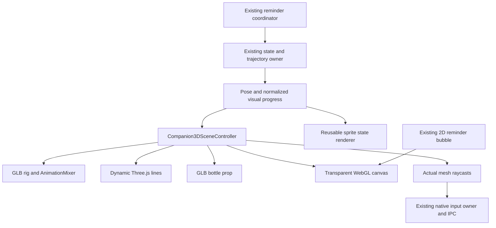

# Phase 7E — 3D companion layer

This report and its captures describe the preceding placeholder renderer. The current [asset integration report](slingsip-3d-integration.md) supersedes its strict clip-loading/morph contract with named-role discovery and explicitly reported fallbacks. Its validation results remain historical evidence for that earlier build.

Implemented locally on 6 October 2026. Three.js renders the companion, webs and bottle in the transparent Electron overlay. Overview, History, Settings, tray and the reminder bubble retain their existing 2D UI. The existing Bezier/pendulum paths, reminder states, hydration calculations, scheduler, retry policy, persistence, startup and IPC operations are preserved. No deployment.

The included models are original **development placeholders**, not final production character artwork. Final asset requirements are in [the asset handoff](companion-3d-assets.md).

## 1. Files created

| Files | Purpose |
| --- | --- |
| `features/companion/three/companion-3d-assets.ts` | Replaceable GLB sources, model scale, named rig sockets and expression names. |
| `features/companion/three/companion-3d-scene.ts` | Orthographic DIP scene, transparent renderer, shared trajectory presentation, activity/idle lifecycle. |
| `features/companion/three/character-model-controller.ts` | GLTFLoader, AnimationMixer, validated clip/socket contract, expressions and resource cleanup. |
| `features/companion/three/web-controller.ts` | Three dynamic lightweight line geometries. |
| `features/companion/three/bottle-controller.ts` | GLB bottle, SlingSip label texture and presentation. |
| `features/companion/three/companion-visual-hit-test.service.ts` | Rendering-only raycast adapter to the existing native input owner. |
| `features/companion/companion-3d.component.ts` | Angular lifecycle, lazy scene import, motion subscriptions, click reaction and fallback. |
| `scripts/placeholder-3d.mjs`, `scripts/generate-placeholder-3d.mjs` | Reproducible original rig/model/clip and GLB generation. |
| `public/assets/character/temporary-3d/` | Placeholder guardian and bottle GLBs, clearly isolated from final art. |
| `animation/body-animation.model.ts`, `body-choreography.ts`, `body-sprite-renderer.component.ts`, `temporary-body-pack.ts` | Reusable visual states/choreography and independent frame-based sprite fallback. |
| `scripts/generate-temporary-body-frames.mjs`, `public/assets/character/temporary-body/` | Reproducible 72-frame temporary vector pack across thirteen clips. |
| `tests/body-rendering.spec.mjs`, `tests/three-companion.spec.mjs`, `tests/helpers/companion-visuals.mjs` | Asset, choreography, geometry, native 3D, fallback and lifecycle coverage. |
| `docs/phase-7e.md`, `docs/companion-3d-assets.md`, `docs/previews/phase-7e/` | Handoff and local visual review. |

Feature paths above are relative to `src/app/`; the `animation/` entries are under `src/app/features/companion/animation/`. No generated models contain downloaded or third-party character art.

## 2. Files modified

`package.json` and the lockfile pin Three.js 0.186.1 and development types 0.186.0. CompanionCharacter mounts the 3D layer and retains a frame-renderer fallback. CompanionInput accepts actual model raycasts alongside existing DOM bubble targets. Companion and the existing Animation lab each provide an isolated visual hit-test scope. The companion template passes existing success copy into decorative water feedback.

CompanionMotionService publishes normalized phase progress to renderers using its existing finite motion clock. It does not change path samples, durations, state transitions or reminder promises. Existing character/advanced/native pointer tests select the active renderer's real visual points; connection-distance, click-through, intake, cancellation and lifecycle assertions remain. README and preceding reports identify historical material.

Modified feature files under `src/app/features/companion/`: `companion-character.component.ts`, `.html`, `.scss`; `companion-input.service.ts`; `companion.component.ts`, `.html`; `animation-lab.component.ts`; and `animation/companion-motion.service.ts`. Modified regressions: `tests/character-motion.spec.mjs`, `tests/advanced-companion.spec.mjs`, `tests/phase-one.spec.mjs` and `tests/hydration-interaction.spec.mjs`. Documentation changes include `README.md` and the historical label in `docs/phase-7d.md`.

Hydration runtime, reminder interaction coordinator, schedule/history/streak calculations, hydration storage, IPC/preload, tray, startup and dashboard layout receive no Phase 7E logic changes. The existing Windows software composition/DirectComposition fix remains enabled.

## 3. Architecture

Visual body states remain separate from the validated reminder/business state machine. No render controller can credit intake, create a retry, reserve a reminder or schedule a hydration event.

## 4. Three.js integration

The scene module loads lazily. GLTFLoader loads local embedded GLBs under the existing CSP. AnimationMixer samples in-place clips at the visual progress supplied by the existing engine. An orthographic camera maps model/socket positions to overlay-local DIPs. Model height scales to the existing 112–196 DIP character envelope, and the raised-grip origin follows the existing trajectory position/rotation.

Integration uses the primary [WebGLRenderer](https://threejs.org/docs/pages/WebGLRenderer.html), [GLTFLoader](https://threejs.org/docs/pages/GLTFLoader.html) and [AnimationMixer](https://threejs.org/docs/pages/AnimationMixer.html) APIs; the runtime dependency is pinned for reproducible local builds.

WebGL2 uses alpha, a zero-alpha clear colour, premultiplied edges, a low-power context preference and no scene background. Lighting uses a hemisphere and one directional light. Shadows, post-processing, physics libraries, reflection maps and heavy transmission are absent. Native WebGL2 was available with the retained Windows GPU fix; Microsoft Basic Render Driver was reported on this machine.

## 5. Rig and expressions

The placeholder has seventeen bones, four body material batches, independent head/face meshes and eighteen clips. Upper/lower arms, hands, hips, knees, feet, chest, head and scarf respond to clips. WebGrip and BottleGrip sockets travel with the actual rig. Blink, smile and frown use morph targets; pupils and head respond subtly to nearby cursor direction. Waiting/disappointed clips tilt the head/body, while success smiles and raises the free arm.

The placeholder proves rigging and integration. Its simple capsule limbs, visible joints and stylized face are not a final premium mesh. Production replacement is a GLB/descriptor change, without rewriting motion or reminder logic.

## 6. Webs and handoffs

Three reused line geometries represent the active swing strand, old-strand retraction and bottle strand. Endpoints come from current world-space rig sockets. All entries perform web 1 attachment, swing body clips, release/retraction, a short free-flight gap, web 2 attachment, a second swing and the existing 420 ms settle. Inverted entry begins at the boot socket.

Old and new swing strands never have positive opacity simultaneously. The free-flight interval has neither strand. Both exits use the same release-before-reattach rule. The screen trajectory remains the existing authored path; web geometry does not introduce a second movement integrator.

## 7. Bottle prop

The separate compact GLB has a teal translucent body, mint cap, cyan base and SlingSip label. Its top origin follows the bottle strand endpoint. The actual free-hand socket supplies the strand start. Within the existing 1.2-second delivery phase, a shot precedes the drop, a damped pendulum peaks above eight degrees and below ten degrees, decorative water feedback appears, and the strand/prop retract before the existing right exit. Small work areas reduce prop size when needed for clearance.

Canonical intake and the existing success bubble update before this presentation. Decorative feedback never issues an intake request. Existing goal-complete/already-logged copy remains authoritative.

## 8. Human interaction

After arrival, an asking gesture leads into hanging animation. Chest sway is about 2.5 DIPs, with subtle breathing and head movement. Blinks are brief and intermittent. Saved cursor/reaction preferences continue to gate gaze and nod/playful/mild annoyed reactions. Real mesh raycasts determine painted character hits; canvas rectangles, web lines and the bottle never claim pointer ownership. Bubble buttons continue to use their existing DOM/native hit tests.

Later and Ignore use the existing Waiting phase, showing waiting/disappointed expression before the existing left exit and retry. Reduced motion suppresses travel, idle rendering, gaze and animated reactions; a short 260 ms appearance/departure remains.

## 9. Performance and fallback

Moving phases render from the existing finite motion callbacks. There is no second screen-motion RAF. Hanging/Waiting use one 15 fps timer, Success uses 24 fps, and low power reduces ambient rendering to 8 fps. Canvas resolution caps at 1600 pixels wide and at device pixel ratio 1, or 0.65 in low power. Identical cursor updates do not render extra frames.

Hidden clears once and stops the visual timer. Suspend/lock and document inactivity pause rendering, cursor probes and sound; resume discards inactive visual wall time. Reopening reuses the native overlay and scene. Destruction cancels timers/listeners, uncaches mixer actions, disposes meshes/materials/textures/skeletons/line buffers, closes image bitmaps where present and releases the WebGL context. Async model results are disposed if their owner is gone.

Missing/unusable WebGL2, invalid/missing assets or context loss switch to the independent sprite renderer. That fallback has thirteen named clips and seventy-two posed vector frames, with a browser-driven hanging loop. No failure path modifies hydration or changes retry timing. Context-loss fallback remains for the life of that scene; reopening the lab or recovering/recreating the native renderer can initialize 3D again.

## 10. Validation

Validated on Windows, 6 October 2026, using Node 24.21.0 and the retained software composition settings. Earlier Phase 7C/7D counts describe their preceding builds, not this 3D implementation.

| Check | Result |
| --- | --- |
| `npm run typecheck` | Passed for Angular and Electron. |
| Production renderer + Electron build | Passed. The Three.js scene is a separate lazy chunk; the initial application remains about 255 kB raw. |
| Complete existing + new Playwright suite | **78 passed, 2 failed, 0 skipped, 0 flaky**, out of 80 tests. |
| Focused secure-intake/goal regression after polling correction | **1 passed**. The exact 450 ms Success-state assertion now polls every 50 ms; goal, intake and security assertions are retained. No application timing changed. |
| Final rendering regression after raised-arm release asset refinement | **8 passed**: all four 3D tests and all four body/fallback tests. |
| Native visual capture | Six flows, 86 sampled frames, 27 PNGs, no renderer page errors. |

There are passing results for **79 of the 80 tests across the complete run and focused reruns**. This is not a clean 80/80 full-suite result. Passing coverage includes existing hydration, scheduler, history/streaks, settings, tray, startup, storage/restart, secure IPC and reminder synchronization checks. New coverage verifies actual skeletal movement, facial morphs/blink, alpha pixels, web release/free-flight/reattachment, actual rig-socket connections, one-glass bottle feedback, hidden/suspended render counts, reduced motion, isolated lab disposal and context-loss sprite fallback.

**Unresolved Windows physical pointer test:** `Native swing regression: transparent overlay, native hydration clicks, secure IPC, reuse, and recovery` failed while the native helper attempted `Move 1153 389`, reporting `The system cannot find the file specified`. The compiled helper exists; its Win32 cursor operation failed. The cause remains unconfirmed. Its physical pointer, painted-hit/click-through, native hydration and recovery assertions are retained. Run this regression on an unlocked interactive Windows desktop before treating physical click-through verification as complete. Synthetic raycasts and other native interaction tests passed, but do not replace that physical test.

Review [the standalone playback/gallery](previews/phase-7e/motion-review.html), [bottle delivery](previews/phase-7e/success-delivering-bottle.png), [the minimum-width lab](previews/phase-7e/animation-lab-minimum.png) and [the unchanged dashboard](previews/phase-7e/dashboard.png). Native screenshots retain alpha; the playback's transparency grid makes it visible. Capture sampling is slower than real-time motion on this machine and is not an FPS benchmark. The minimum-width screenshot keeps the wordmark and settled model inside their existing bounds. [Machine-readable validation summary](previews/phase-7e/validation-summary.json) records the separate runs.

For final production art, provide **two GLBs**, their editable source and license notes: a rigged character with all eighteen named clips, five named sockets and blink/smile/frown morphs; and a branded teal bottle with its web attachment at the top origin. Exact names, coordinates, clip behavior and budgets are in [the final asset contract](companion-3d-assets.md). Web assets are generated dynamically and do not require a GLB. Final fallback frames are optional and specified separately there.

## 11. Manual checklist

- Run `npm run dev`, open Animation lab and review all entries, success/bottle and retry exits. Check knees/arms/head move independently of the screen path.
- Trigger a real reminder. Confirm the bubble appears after settle, blank desktop space passes through, and only the actual character/bubble receives clicks.
- Drink once and double-click. Confirm one configured/capped glass, shared progress, smile, shot, visible bottle drop/swing, correct feedback, full retraction and right exit.
- Try Later and Ignore; verify the waiting face, left exit, actual retry interval and one returning companion.
- Move near/away; test slow/rapid character clicks, then disable gaze/reactions in the existing preferences.
- Enable reduced motion before and during entry. Review short fades, usable controls and stationary endpoints. Toggle low power and confirm saved settings survive restart.
- Close the dashboard; use the unchanged tray controls and check scheduling/history/streaks/startup as before.
- Lock/unlock and sleep/resume. Check no hidden visual/audio loop and no motion jump.
- Review alpha edges, taskbar clearance and all variants on real 1366×768, 1920×1080 and 2560×1440 displays at 100%, 125% and 150%, including monitor changes/negative origins.
- Inspect CPU/memory on the actual GPU/driver during long hidden and idle periods. Software WebGL can be more expensive; automated frame counters are not a battery benchmark.

## 12. Known limitations and stop point

Final character art is still required. Cloth, fingers and expressions are deliberately simple placeholders; no collision/cloth simulation or IK retargeting is included. The scene uses in-place clips and configured rig sockets rather than accepting arbitrary unprepared skeletons. The existing screen path supplies visual gravity, not a new 3D physics simulation. Primary-monitor placement and small-work-area limits remain. Software WebGL can cost CPU; secure desktop/exclusive fullscreen and every physical scaling/GPU combination require manual review. The 2D fallback is maintained for graphics failure.

The next step is review and delivery of the final assets listed in [the exact asset handoff](companion-3d-assets.md). No deployment, installer, cloud/backend or dashboard redesign is included.
