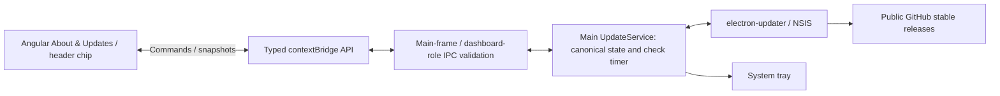

# SlingSip V1 — application update infrastructure

Prepared locally on **9 October 2026**. No release, installer upload or V2 feature has been published.

The existing Angular/esbuild pipeline had no installer. This change adds **electron-builder NSIS** packaging around its existing outputs and **electron-updater** ownership in main. The provider is the user-selected public repository **ak-ak-k/slingsip**. Local/source development and unsigned previews cannot run the real updater.

**Distribution gate:** a real Windows signing certificate and its exact publisher subject are still required. The unsigned preview is for local artifact review, not distribution. A real signed installed-version-to-next-version update has not been exercised; complete the installed acceptance checklist before distributing V1.

## Architecture and lifecycle



- Central states: `idle`, `checking`, `available`, `downloading`, `downloaded`, `not-available` and `error`. Snapshots include actual application version, available version, progress, bounded plaintext release information, last check attempt, enabled/automatic status and install/error flags.
- Only `checkForUpdates()`, `downloadUpdate()` and `restartAndUpdate()` are added to the preload. They accept no provider, URL, token or filesystem argument. Main permits only the trusted dashboard main frame; the companion cannot issue these commands.
- State joins the existing revisioned snapshot broadcast. Dashboard and tray consume the same main-owned state. Angular has no updater object and makes no update network requests.
- Signed installed Windows builds check after 30 seconds, then every six hours. Startup is not blocked. Repeated checks/downloads/install clicks are guarded; stopped services clear their timer, unsubscribe and cancel pending downloads.
- The library performs semantic-version comparisons. `latest` maps to the stable channel; prereleases and downgrades are disabled. The release build also rejects prerelease version stamps. No beta channel selection is exposed.
- Downloads are explicit: `autoDownload = false`. `autoInstallOnAppQuit = false` makes normal **Quit SlingSip** and **Restart SlingSip** independent of update installation.
- **Restart & Update** first uses the existing `persistForRestart` routine. It refuses an active visible/entering reminder and does not record water. A save failure leaves the session running. The updater's `quitAndInstall(false, true)` starts the proper installer/relaunch handoff; the existing idempotent `before-quit` cleanup stops timers, windows and tray.
- Network/download/verification errors stay in About & Updates. A failed install initiation returns to the ready state. Update state/error does not occupy hydration's UI busy/error state.

## Dashboard and tray

Settings adds a matching **About & Updates** card: SlingSip, actual version, automatic check status, last attempt and **Check for updates**. Availability includes **Download update / Later**; download uses real updater progress; ready includes **Restart & Update / Later**.

The compact header chip appears for availability, download, ready or a failed download. Clicking it opens Settings and scrolls to About & Updates. Later collapses details only; it does not clear a download or request installation. No modal interrupts a reminder. Header actions can wrap at the existing minimum window width.

The tray adds **Update ready — Restart & Update** only when ready. It is disabled while a reminder is active or installation is already requested. Existing drink, pause, reopen, Settings, normal Restart and Quit actions remain.

## Packaging, provider and security

Pinned dependencies: runtime `electron-updater 6.8.9` and `js-yaml 4.3.2` (trusted packaged metadata parsing); development `electron-builder 26.15.3` and `@types/js-yaml 4.0.9`. The new `@electron/get → global-agent 4.1.3` override removes the vulnerable legacy proxy/logging chain in the packaging tool. Existing Angular, Electron and TypeScript pins remain. See the validation record for the dated audits.

`release.config.json` contains only public provider/channel/publisher identity. The GitHub owner/repository are fixed to the approved public feed. No private GitHub credential is accepted in release configuration, sent through IPC or embedded in the application. A future private source repository can use a separate public releases repository; a private artifact service would need a server-side authenticated delivery design rather than a shared client token.

Packaging preserves `dist/electron` and `dist/renderer/browser`. Main is ESM, preload CJS; electron-store, electron-updater and js-yaml are external dependencies loaded natively by Node. NSIS is the only installer architecture added.

- Stable application identity: `com.slingsip.desktop`; product/executable name **SlingSip**. Keep these stable in later versions.
- Windows x64, per-user one-click NSIS; `deleteAppDataOnUninstall = false`.
- Production `forceCodeSigning = true` and `verifyUpdateCodeSignature = true`. Set the **full exact certificate subject** using `SLINGSIP_WINDOWS_PUBLISHER` or the public `publisherName` field. An empty identity prevents a release build.
- The updater's HTTPS transport, SHA-512 artifact validation and Windows publisher-signature verification remain enabled. No certificate bypass, arbitrary URL API or manual executable replacement is implemented.
- The packaged public update policy enables the real backend only for a configured packaged Windows release. Preview policy is explicitly disabled and has no update feed.
- Before creating the backend, main parses the actual `app-update.yml` and requires its GitHub provider/repository and exact publisher to match that policy. Missing/mismatched publishers, alternate hosts, HTTP, beta channels and secret-bearing feed configuration are rejected. This closes the upstream verifier's behavior of skipping publisher verification when that field is absent.
- Installer icon comes from the existing logo rasterizer at 256px. Its default 32px tray/window raster was verified unchanged.
- Build outputs whitelist application bundles/dependencies and public policy; local hydration/profile/preference files, signing files, source maps and test results are not application payload.
- Every repository packaging command uses `publish: 'never'`. Output folders and common signing/environment files are ignored by Git.

```powershell
npm ci
npm run typecheck
npm run build

# Unsigned, update-disabled local artifact review
npm run package:dir

# Signed NSIS artifacts only; configure signing first. Still does not publish.
npm run package:win
```

The preview is `release/preview/win-unpacked/SlingSip.exe`. Signed release artifacts belong in `release/stable/`. A portable exe or `npm start` source launch is not the installed NSIS update path.

Signing credentials belong only in the trusted build environment/certificate store. Provision electron-builder's `CSC_LINK` and `CSC_KEY_PASSWORD` securely where appropriate; do not put them in release JSON, frontend source or public artifacts. The publisher subject is public metadata, not a signing secret.

## Persistence and version strategy

Normal `userData` and `sessionData` still use **%APPDATA%\Mizu**, configured before the single-instance lock. `hydration.json`, `user-profile.json` and `companion-preferences.json` stay outside replaceable application resources. Saved history retains its original daily goals; streaks remain derived from it. No schema, stored key, onboarding flag, local data directory or `Mizu` Windows startup registration migration is introduced.

The version remains **0.1.0** until the release owner deliberately stamps V1. All update/version UI reads `app.getVersion()` from main. The normal restart implementation is retained. Pending reminder returns are session-only and are safely reconstructed/cancelled by the existing restart lifecycle.

Suggested release progression: **1.0.0** V1, **1.0.1** fixes, **1.1.0** V1 enhancements, **2.0.0** a future V2. No Smart Alerts, Gmail, Outlook or Calendar functionality was added here.

## Verification and safe development testing

The new `tests/updater.spec.mjs` covers state transitions, delayed/occasional checks, disabled source builds, failed check/download/install, persistence-before-install, reminder guarding, UI deferral/progress, canonical tray status, inert release notes and water/profile/history preservation across restart.

A fake backend is available **only** when the main process is unpackaged and both `--companion-test` and `--companion-test-updater` are supplied. It uses the existing isolated test profile. Driver controls are main-only; no simulation IPC or production UI is added. Mock installation never invokes a real installer. These captures are clearly test evidence, not proof of a published release.

```powershell
npm run build
npx playwright test tests/updater.spec.mjs
```

The [validation record](slingsip-updates-validation.json) records build/typecheck, the affected regression run, artifact inspection and audit results. The [native update UI gallery](previews/updates/index.html) shows local-disabled, available, downloading, ready/minimum-width and error states.

Local results: **type checking and production build passed; all 58 affected regression tests passed**. After the final packaged-feed/signing validation changes, **all seven updater tests passed again**. The seven are included in the 58, not additional distinct tests. All-dependency and production-dependency npm audits reported **zero vulnerabilities** on 9 October 2026.

The final unsigned preview packaged successfully. Its main/preload bytes match the current build, required runtime dependencies are present, and inspection found no source maps, local data records, environment files or signing files. Authenticode reports **NotSigned**, as expected for this preview; its policy is disabled and `app-update.yml` is absent. Attempting the release path without a publisher failed before packaging, as intended. No signed NSIS installer or actual installed update chain was tested.

Compared with the 197-file demo-freeze source baseline, 182 files remain identical; the 15 changes are update wiring/UI, packaging/dependencies and the icon rasterizer's optional installer size. All 92 tracked hydration/reminder/companion/profile/startup implementations and assets checked remain identical. The default 32px native logo PNG is byte-identical. Existing tests were not weakened.

The pre-existing automated native pointer regression remains a known flaky Windows test-harness limitation. It was not relabelled or weakened. The earlier manual physical click-through pass remains documented in the [8 October Final QA report](slingsip-final-qa-2026-10-08.md). Signed installed update testing is an additional, currently pending distribution check.

## Files changed

| Area | Files |
| --- | --- |
| Main updater | `electron/update-service.ts`, `electron/update-backend.ts`, `electron/update-test-driver.ts`, `electron/main.ts` |
| Contract/security | `shared/update-contract.ts`, `shared/desktop-contract.ts`, `electron/preload.ts`, `electron/desktop-ipc.ts` |
| Native lifecycle/icon | `electron/tray-controller.ts`, `electron/tray-icon.ts` |
| Angular state/UI | `src/app/core/services/application-updates.service.ts`, `desktop.service.ts`; `src/app/features/updates/{about-updates,update-panel,update-status}.component.ts` |
| Existing view integration | `src/app/features/settings/settings.component.{ts,html}`; `src/app/features/dashboard/dashboard-shell.component.{ts,html,scss}` |
| Build/config | `release.config.json`, `scripts/windows-package-config.mjs`, `scripts/package-windows.mjs`, `scripts/prepare-windows-icon.mjs`, `scripts/build-electron.mjs`, `package.json`, `package-lock.json`, `.gitignore` |
| Tests/docs | `tests/updater.spec.mjs`, `README.md`, this report, `slingsip-updates-validation.json` and update UI captures/gallery |

Hydration/domain/storage/profile/scheduler/startup and companion choreography implementations remain unchanged.

## Before distributing V1

1. Obtain/provision Windows signing, set the exact publisher subject and keep signing secrets private.
2. Deliberately stamp the release version, for example `npm version 1.0.0 --no-git-tag-version`. Keep package and lockfile synchronized.
3. Run typecheck/build, updater tests and affected regression tests. Build `npm run package:win`. It generates local files only.
4. Verify Authenticode on the application and installer, matching publisher in `app-update.yml`, public feed identity, version and the installer/hash/blockmap metadata.
5. Run the signed installed acceptance checklist below on an isolated Windows user/VM. Do not distribute the unsigned preview.
6. Only when separately authorized, upload the signed installer, its `.blockmap` and `latest.yml` as GitHub release assets. This task did not do that.

## When a future v2.0.0 is eventually published

1. Implement/QA that release separately and preserve application ID, product name, installation identity, legacy userData path and compatible hydration/profile schemas.
2. Set `2.0.0` via `npm version 2.0.0 --no-git-tag-version`. Build with the same trusted signing identity and `npm run package:win`.
3. Verify `SlingSip-Setup-2.0.0-x64.exe`, its `.exe.blockmap` and generated `latest.yml`. Test the V1→V2 transition on an installed signed V1 before public rollout.
4. With separate publication authorization, create the **v2.0.0** release in **ak-ak-k/slingsip**, upload all generated artifacts together, and publish it as a normal stable release. Beta/nightly releases must be marked prerelease and excluded from stable metadata.
5. Installed V1 users then see availability automatically or via Check for updates, choose Download, and explicitly choose Restart & Update. The NSIS updater replaces the application and relaunches it while the existing local data stays in place.

No GitHub upload token belongs in a distributed app. Any future upload credential is maintainer/CI-only.

## Signed installed acceptance checklist

- Install signed V1 on an isolated Windows account/VM; finish onboarding, edit profile/routine, record water and retain genuine archived history/streak fixtures.
- Confirm one tray/background owner and that dashboard X/reopen still works.
- Supply a separately authorized signed higher-version release with the same identity. Verify automatic and manual checks, stable-only selection and real download progress.
- Keep a reminder open while downloading; Drank/Later must work. Restart & Update must remain blocked while interacting with the reminder.
- Choose Later for available/ready UI. Normal Restart/Quit must not install it.
- Choose Restart & Update after the reminder hides; verify the installer succeeds, the app relaunches once and the displayed version changes.
- Compare display name, creation date, onboarding completion, water, history, streaks, routine, reminder/motion preferences and Windows startup registration before/after.
- Test offline checking, interrupted/corrupt download and an incorrect publisher signature. The app must remain usable and unverified updates must never become ready.
- Check stable clients reject beta/nightly and downgrade offers. Check no fixture controls or secrets are present in a packaged production UI.

Current handoff: **local update infrastructure verified; signing and signed installed-update acceptance pending**. The earlier hydration-demo recommendation remains historical and is not a claim that distribution has passed these additional checks.

References: [stable electron-builder auto-update documentation](https://www.electron.build/v26/docs/features/auto-update/) and [Windows signing documentation](https://www.electron.build/v26/docs/features/code-signing/).
